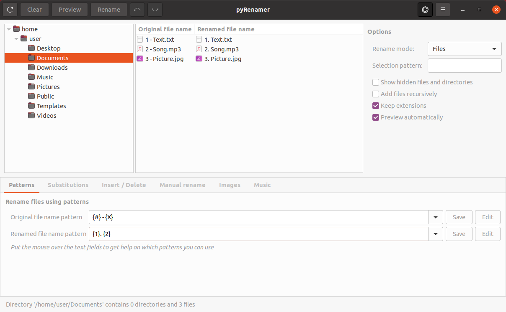

# pyRenamer

pyRenamer is an application for mass file renaming.

Files can be renamed using patterns, substitutions, inserting or deleting text, or even manually.
Image files can be also renamed using their EXIF tags, and music files can be renamed using their internal metadata.

pyRenamer is released under the terms of the GNU General Public License Version 3.




## About this repository

This repository contains an evolved version of the [original pyRenamer](https://github.com/infinicode/pyrenamer) after being migrated to Python 3 and GTK+ 3.

pyRenamer was once a very common application in many Linux distributions but it became unmaintained some years ago.
It is no longer available in modern distributions and original code does not run without installing old dependencies.
I really missed pyRenamer so I have tried to revive it by migrating the code to Python 3 and GTK+ 3 so it runs again in modern Linux distributions.


## Requirements

In order to run pyRenamer, you need:
* Python 3.7+
* PyGObject 3.36 (Python3 bindings for GObject introspection)
* pytaglib 0.3.6 (Python audio metadata library based on [TagLib](https://taglib.org/))

And the following packages with GObject introspection:
* GLib 2.64
* GTK+ 3.24
* GExiv2 0.12 (GObject wrapper around the [Exiv2](http://www.exiv2.org/) photo metadata library)

On a Debian-based Linux, you can install the requirements by running:

```sh
$ sudo apt install python3-gi python3-taglib gir1.2-glib-2.0 gir1.2-gtk-3.0 gir1.2-gexiv2-0.10
```


## Build requirements

In order to build pyRenamer, you need:

* Python 3.7+
* Meson 0.60+
* Ninja
* gettext
* appstream-util
* libxml2-utils
* Development packages for PyGObject, GTK+ and GExiv2

On a Debian-based Linux, you can install the build requirements by running:

```sh
$ sudo apt install python3-pip gettext appstream-util libxml2-utils python-gi-dev libgtk-3-dev libgexiv2-dev
$ sudo pip install 'meson>=0.60' ninja
```


## Building

pyRenamer uses the [Meson Build system](https://mesonbuild.com/). Use the following commands to build pyRenamer from the source directory:

```sh
$ meson _build
$ cd _build
$ ninja
```

You can then install pyRenamer system-wide by running:

```sh
$ ninja install
```

Note that you *do not* need to build pyRenamer in order to run it. pyRenamer can be run directly from this source directory by running:

```sh
$ bin/pyrenamer
```


## Running

If pyRenamer has been system-wide installed you can launch it from your desktop or from a shell by running `pyrenamer`.

pyRenamer support several command line options:
* Select `/home/user/Music` as the active directory:
    ```sh
    $ pyrenamer /home/user/Music
    ```

* Set `/media/music` as the root directory on the directory tree:
    ```sh
    $ pyrenamer --root /media/music
    ```

* The same than before, but setting `/media/music/classic` as the active directory:
    ```sh
    $ pyrenamer --root /media/music /media/music/classic
    ```

* Get help:
    ```sh
    $ pyrenamer --help
    ```
